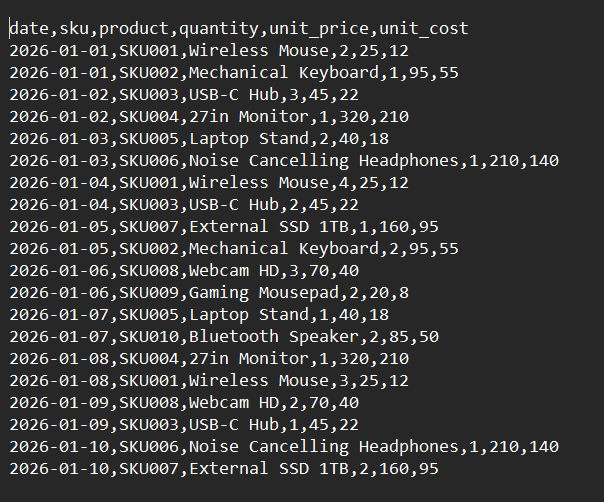
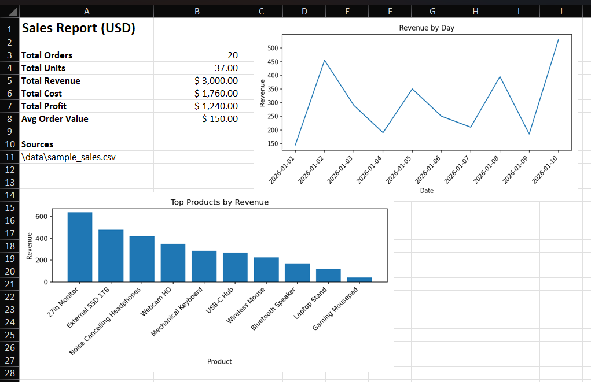
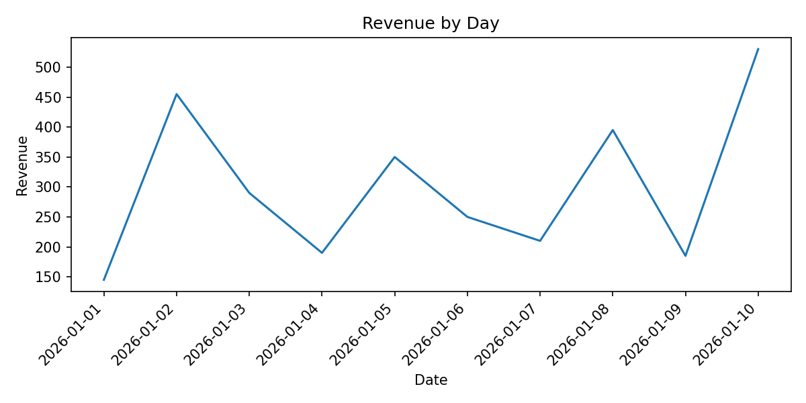
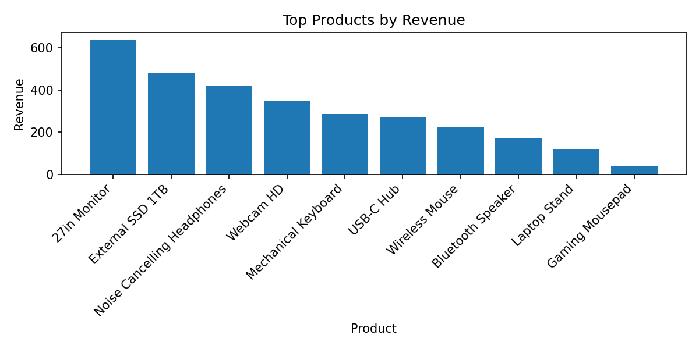

# 📊 Data Report Automation

> Python CLI tool that transforms raw sales files (CSV/XLSX) into a clean dataset, business KPIs, charts, and a formatted Excel report.

[](https://www.python.org/downloads/)
[](LICENSE)
[](#-tests)

---

## ✨ Overview

This project automates a common analytics workflow:

1. Load one file or a full folder of source files  
2. Normalize columns and clean records  
3. Compute sales KPIs (revenue, cost, profit, AOV, top products)  
4. Generate charts  
5. Export everything to a formatted Excel workbook  

The project is designed as a **portfolio-ready example of practical data automation and reporting pipelines using Python**.

---

## ⚡ Quick Start

```bash
git clone https://github.com/Lautarocuello98/data-report-automation.git
cd data-report-automation
pip install -r requirements.txt
python cli.py --input data/sample_sales.csv --output reports
```

---

## 📸 Example

### 📥 Input (CSV Source File)

Example dataset used as input.



---

### 📤 Output (Generated Excel Report)

Example Excel report generated by the system.



The generated report includes:

- Summary KPI dashboard
- Cleaned dataset
- Top products analysis
- Embedded charts

---

### 📊 Generated Charts

  


---

## 🚀 Features

| Feature | Description |
|--------|-------------|
| Multi-file ingestion | Process a single file or an entire folder |
| Data cleaning | Remove duplicates, normalize numbers, validate records |
| KPI calculations | Revenue, cost, profit, average order value |
| Excel reporting | Multiple formatted sheets |
| Charts | Automatic visualization of sales data |
| Logging | Full processing log (`processing.log`) |
| Tests | Automated testing with `pytest` |

---

## 🏗 Architecture

Execution pipeline:

```
cli.py
  → src/loader.py           (load and merge input files)
  → src/cleaner.py          (validate and normalize data)
  → src/processor.py        (compute KPIs)
  → src/charts.py           (generate charts)
  → src/report_generator.py (build Excel workbook)
```

Module responsibilities:

**cli.py**

- CLI argument parsing
- configuration loading
- orchestration
- logging setup

**loader.py**

- loads CSV/XLSX files
- merges datasets
- applies column mapping
- tracks source files

**cleaner.py**

- validates required columns
- removes duplicates
- handles missing values
- normalizes fields

**processor.py**

- computes totals and business KPIs
- aggregates product performance

**charts.py**

- generates visualization images

**report_generator.py**

- creates Excel report
- builds formatted sheets

---

## 📁 Project Structure

```
data-report-automation/
│
├── cli.py
├── config.json
├── requirements.txt
├── README.md
├── LICENSE
│
├── data/
│   └── sample_sales.csv
│
├── src/
│   ├── loader.py
│   ├── cleaner.py
│   ├── processor.py
│   ├── charts.py
│   └── report_generator.py
│
├── tests/
│   ├── conftest.py
│   ├── test_loader.py
│   ├── test_cleaner.py
│   ├── test_processor.py
│   └── test_report_generator.py
│
├── images/
│
└── reports/              # generated outputs
```

---

## ⚙️ Installation

### Requirements

- Python **3.10+**
- `pip`

### Setup

```bash
git clone https://github.com/Lautarocuello98/data-report-automation.git
cd data-report-automation
pip install -r requirements.txt
```

---

## ▶️ Usage

Run against a folder:

```bash
python cli.py --input data --output reports
```

Run against a single file:

```bash
python cli.py --input data/sample_sales.csv --output reports
```

Optional flags:

```
--config config.json
--verbose
```

Expected outputs:

```
reports/
│
├── sales_report.xlsx
├── processing.log
│
└── charts/
    ├── revenue_by_day.png
    └── top_products.png
```

---

## 🧪 Tests

Run the automated test suite:

```bash
pytest -v
```

---

## 🧰 Tech Stack

- Python
- pandas
- openpyxl
- matplotlib
- pytest

---

## 📄 License

This project is licensed under the **MIT License**.

See [LICENSE](LICENSE) for details.

---

## 👨‍💻 Author

Lautaro Cuello  

GitHub  
https://github.com/Lautarocuello98

---

⭐ If you found this project useful, consider giving the repository a star.